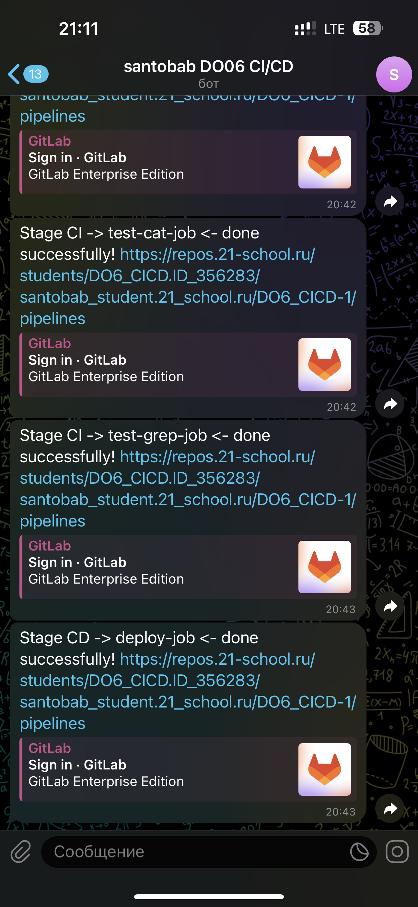

# Basic CI/CD

- [Part 1. Setting up the gitlab-runner](#part-1-setting-up-the-gitlab-runner)
- [Part 2. Building](#part-2-building)
- [Part 3. Codestyle test](#part-3-codestyle-test)
- [Part 4. Integration tests](#part-4-integration-tests)
- [Part 5. Deploymeny stage](#part-5-deployment-stage)
- [Part 6. Bonus notifications](#part-6-bonus-notifications)

## Part 1. Setting up the **gitlab-runner**

### Start *Ubuntu Server 22.04 LTS* virtual machine.


lab_release -a 

- Download libraries for make, compiling and style-test
    
    `sudo apt install gcc`
    
    `sudo apt install make`
    
    `sudo apt install clang-format`
    

### Download and install **gitlab-runner** on the virtual machine.

- Download and configure gitlab-runner:
    
    `sudo curl -L --output /usr/local/bin/gitlab-runner "https://gitlab-runner-downloads.s3.amazonaws.com/latest/binaries/gitlab-runner-linux-amd64"`
    
    `sudo chmod +x /usr/local/bin/gitlab-runner`
    
    `sudo useradd --comment 'GitLab Runner' --create-home gitlab-runner --shell /bin/bash`
    
    `sudo gitlab-runner install --user=gitlab-runner --working-directory=/home/gitlab-runner`
    
    `git config --global --add safe.directory /home/gitlab runner/builds/hvfWVK_D/0/students/DO6_CICD.ID_356283/santobab_student.21_school.ru/DO6_CICD-1`
    


downloading and configurating gitlab runner

### Run **gitlab-runner** and register it for use in the current project (*DO6_CICD*).


registrating runner via credentials

- we have to register
    - `sudo gitlab-runner register`
    - `URL - https://repos.21-school.ru`
    - `Registration token - -`
    - `Description - DO6_CICD`
    - `Tags - build, style, test, deploy`
    - `Options - -`
    - `Executor - Shell`


running gitlab runner 

## Part 2. Building

### In the *gitlab-ci.yml* file, add a stage to start the building via makefile from the *C2* project.

### Save post-build files (artifacts) to a random directory with a 30-day retention period.


first stage - build


added cat and grep files from C2 project 

- push and check result of pipeline


successful pipeline


output of pipeline


successful run of build test 

## Part 3. Codestyle test

### Write a stage for **CI** that runs a codestyle script (*clang-format*).


codestyle test

### If the codefile didn't pass, "fail" the pipeline.

- I’ll change some rows of code to “fail” this check


error while testing style

### In the pipeline, display the output of the *clang-format* utility.

- `echo "Beginning style test"`
- `clang-format -n -style=Google src/****/*.c src/****/*.h`
- `clang-format -i -style=Google src/****/*.c src/****/*.h`
- `echo "Beginning style test"`
- `git diff --exit-code`


successful run of style-test

## Part 4. Integration tests

### Write a stage for **CI** that runs your integration tests from the same project.


tests for utilities

### Run this stage automatically only if the build and codestyle test passes successfully.


separated stages for tests

### If tests didn't pass, "fail" the pipeline.


failing test for checking pipeline

### In the pipeline, display the output of the succeeded / failed integration tests.


Job succeeded


- To get a successful stage, I had to change the successful ending conditions to half successful tests.

## Part 5. Deployment stage

### Start the second virtual machine *Ubuntu Server 22.04 LTS*.

For this stage ws2 should be prepared for catching compiled files from ws1. 

- clone ws1 → ws2


- set connection via netplan /etc/netplan/:


and set the second one to:

- `10.10.0.1`
- `via: 10.10.0.2`

Pinging each other to check connection


In order to execute command of moving objects or copying files we have to set ssh connection between two ws:

- `ssh-copy-id santobab@10.10.0.2`


Actually, there was a problem of owning directories and having access to cp and mv files from, but these problems can be solved by running runner via runner-user. In this case we dont have to set ownership to ws1. 

### Write a stage for **CD** that "deploys" the project on another virtual machine.

### Run this stage manually, if all the previous stages have passed successfully.

### Write a bash script which copies the files received after the building (artifacts) into the */usr/local/bin* directory of the second virtual machine using **ssh** and **scp**.


scp → command for copying file to server via ssh

- StrictHostKeyChecking allows you to control how SSH clients handle unknown or changed host keys when connecting to remote servers. When this option is enabled, SSH clients will enforce strict host key checking behavior, which helps enhance security by verifying the identity of the server before establishing a connection. Set `=no`

### In the *gitlab-ci.yml* file, add a stage to run the script you have written.


Manually running deploy stage

As a result we have in `/usr/local/bin` directory files from utilities which was built in ws1 


/usr/local/ directory

### In case of an error, fail the pipeline. → I had errors with ownership


## Part 6. Bonus. Notifications

We have to get token from Botfather


Then we can get chat id from [`https://api.telegram.org/bot<TOKEN>/getUpdates`](https://api.telegram.org/bot<TOKEN>/getUpdates) url 


Then we write bash script which will be called after every stage:

- `CI_*` → these variables are variables of gitlab runner
- Condition of success message is succeeded stage:


Then we sending POST to our chat:

```
curl -X POST "https://api.telegram.org/bot$BOT_TOKEN/sendMessage" -d chat_id=$CHAT_ID -d text="$MESSAGE"
```


Final version of `.gitlab-ci.yml` file


Telegram notifications



In phone 

Set up notifications of successful/unsuccessful pipeline execution via bot named "santobab DO6 CI/CD" in *Telegram*.